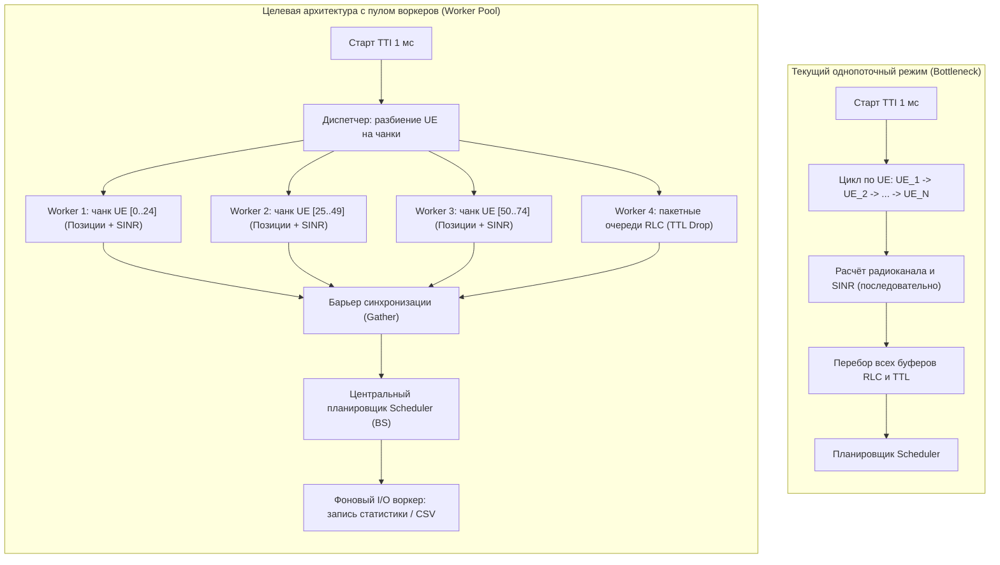

# Отчёт: Исследование воркеров и концепции параллельной оптимизации симулятора

**Период:** Неделя 2  
**Основные объекты анализа:** `BS_MODULE.py`, `UE_MODULE.py`, `MOBILITY_MODEL.py`  

---

## 1. Введение: что такое воркеры в контексте сетевого симулятора

В архитектуре параллельных вычислений **воркер (Worker / Рабочий исполнитель)** — это независимый исполнительный блок (поток `Thread`, изолированный процесс `Process` или асинхронный обработчик задач в пуле), которому поручается параллельное выполнение однотипных изолированных подзадач из общей очереди без взаимных блокировок.

В симуляторе **PyScheduler** время дискретизировано на кванты **TTI (1 миллисекунда)**. Каждую миллисекунду система должна производить большой объём расчётов:
1. Передвигать десятки и сотни абонентов (кинематика, отскоки от границ карты).
2. Вычислять расстояния, углы визирования, прохождение сквозь стены помещений (outdoor/indoor ray-tracing).
3. Моделировать радиоканал, замирания (TDL) и рассчитывать матрицы SINR/CQI на каждом ресурсном блоке (PRB).
4. Проверять время жизни очередей пакетов в буферах L2/RLC и удалять просроченные данные (PDCP Discard Timer).

Идея применения **воркеров** заключается в том, чтобы разгрузить главный поток симулятора и распределить ресурсоёмкие расчёты абонентов и очередей по доступным ядрам процессора.

---

## 2. Как устроена работа с задачами в текущей системе

На данный момент симулятор работает в **строго синхронном, однопоточном режиме**. Все вычисления выполняются поочерёдно в едином цикле `SimulationManager.run_tti`.

### 1. Модель движения (`MOBILITY_MODEL.py`)
- Модели (`RandomWalkModel`, `RandomWaypointModel`, `GaussMarkovModel`) производят тригонометрические вычисления ($\sin / \cos$) и генерацию псевдослучайных величин скалярно для каждого терминала.
- Общие границы карты заданы через синглтон `MapBorders`.
- Вызов метода `update(time_ms)` происходит последовательно в цикле Python.

### 2. Пользовательские устройства (`UE_MODULE.py`)
- Класс `UECollection` управляет группой абонентов через метод `UPDATE_ALL_USERS`:
  ```python
  for ue in self.users.values():
      if current_time % mob_interval == 0:
          ue.UPD_POSITION(mob_interval)
      if current_time % ch_interval == 0:
          ue.UPD_CH_QUALITY(ch_interval)
  ```
- Метод `UPD_POSITION` обновляет кинематику и выполняет геометрический расчёт луча `_calculate_distances_to_BS`.
- Метод `UPD_CH_QUALITY` вызывает математическую модель радиоканала базовой станции для расчёта затухания и SINR.

### 3. Базовая станция и буферы (`BS_MODULE.py`)
- Менеджеры буферов (`SimpleBufferManager` и `LayeredBufferManager`) в методе `upd_buffers_all` последовательно обходят всех абонентов.
- В буфере сущности `RLCUM` на каждом шаге выполняется полный перебор очереди `deque` для выявления устаревших по таймеру пакетов (`packet.age > pdcp_discard_timer`).

### 4. Прообраз воркеров в проекте
Единственное место, где механизм воркеров уже упомянут в тестах — это стресс-тест в `test_mobility_module_stress.py`:
```python
def _run_collection(self, col, n_steps, results, idx, errors):
    """Worker-функция для потока."""
    for step in range(n_steps):
        for ue in col.GET_ALL_USERS():
            ue.UPD_POSITION(500)
```


---
## 3. Схема работы: последовательный цикл против параллельного пула воркеров



---

## 4. Пути и методы теоретической оптимизации

### 1. Распараллеливание процессов (Worker Pool & Chunking)
- **Принцип:** Все абоненты делятся на равные порции (чанки) по количеству ядер процессора.
  $$\text{Chunk Size} = \lceil N_{\text{UE}} / N_{\text{Cores}} \rceil$$
- Пул процессов (`concurrent.futures.ProcessPoolExecutor`) обходит ограничение GIL и параллельно рассчитывает векторы координат и уровни SINR на всех ядрах процессора.

### 2. Векторизация вычислений через NumPy
- **Принцип:** Вместо медленного перебора каждого абонента по отдельности в цикле, все координаты, скорости и направления хранятся в виде таблиц (матриц) NumPy.:

- **Эффект:** Математические операции над координатами выполняются сразу для всей группы объектов одной командой. Это ускоряет расчёт движения в десятки раз даже на одном ядре.

### 3. Алгоритмическая оптимизация буферов базовой станции
- **Принцип:** Пакеты данных в очереди базовой станции выстроены строго по порядку (FIFO):

- **Эффект:** Вместо проверки всей очереди целиком, программа мгновенно сбрасывает устаревшие пакеты с самого начала («с головы»), как только истекает их время жизни. Это снижает сложность алгоритма и уменьшает нагрузку на процессор.


---


## 5. Итоги

1. Модули `BS_MODULE.py`, `MOBILITY_MODEL.py` и `UE_MODULE.py` в текущей реализации образуют последовательную синхронную цепочку вычислений, создающую узкое место при увеличении количества абонентов.
2. Воркеры в симуляторе идеально подходят для параллелизации независимых состояний (кинематика абонентов, расчёт затухания сигнала и независимые очереди RLC). Централизованным остаётся только планировщик базовой станции, распределяющий общие радиоресурсы (PRB).


## 6. TODO

В качестве дальнейших шагов планируется детальное изучение полной структуры проекта и принципов взаимодействия всех модулей, а также разработка наглядной блок-схемы работы симулятора по всем ключевым направлениям и анализ маршрутизации задач между подсистемами.