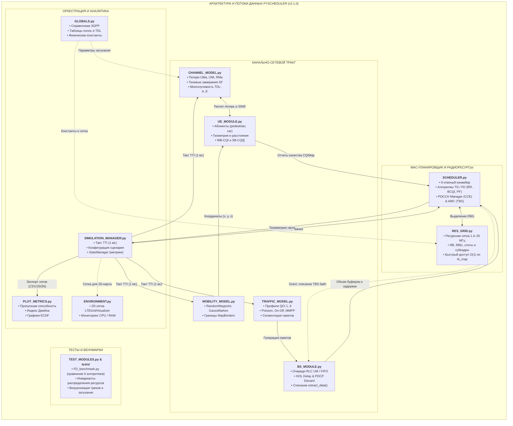

# Отчёт: Архитектура симулятора PyScheduler и межмодульное взаимодействие

**Период:** Неделя 3 (03.10.2026)  
**Объекты изучения:** архитектура программного комплекса **PyScheduler** (Release v2.1.0), межмодульные интерфейсы и сквозные потоки данных.  
**Связанные исходные файлы:** `SIMULATION_MANAGER.py`, `SCHEDULER.py`, `RES_GRID.py`, `CHANNEL_MODEL.py`, `TRAFFIC_MODEL.py`, `BS_MODULE.py`, `UE_MODULE.py`, `MOBILITY_MODEL.py`, `GLOBALS.py`, `ENVIRONMENT.py`, `PLOT_METRICS.py`, `TEST_MODULES.py`.

---

## 1. Введение и цели 3-й недели

Главная задача 3-й недели — переход от локального исследования отдельных сущностей (мобильности, очередей и концепции воркеров, рассмотренных на Неделях 1–2) к **комплексному пониманию архитектуры всей системы**.

**Ключевые цели:**
1. Разработать единую наглядную **структурную схему взаимодействия модулей**, связывающую генерацию трафика, физику радиоканала, диспетчеризацию L2/MAC и сбор аналитики.
2. Подготовить лаконичное описание принципов работы схемы (потоки управления и данных в такте TTI).
3. Систематизировать функционал **всех модулей симулятора** в компактном виде для дальнейшей практической оптимизации и внедрения пула параллельных воркеров.

---

### 2. Схема компонентов и потоков данных (Mermaid Flowchart)

---

### 2.1. Пояснение к диаграмме: поток сигналов и данных в такте TTI (1 мс)

Функционирование симулятора построено вокруг миллисекундного дискретного шага (TTI), координируемого диспетчером `SIMULATION_MANAGER.py`:

1. **Генерация нагрузки:** модуль `TRAFFIC_MODEL.py` генерирует пакеты с заданными приоритетами QCI и помещает их в очереди базовой станции `BS_MODULE.py`. Буфер отслеживает время ожидания (HOL Delay) и удаляет просроченные пакеты по таймеру `PDCP Discard`.
2. **Кинематика и радиофизика:** `MOBILITY_MODEL.py` смещает абонентов в пространстве, после чего `CHANNEL_MODEL.py` вычисляет затухание (крупномасштабные потери, затенение, профили TDL) и передает терминалам `UE_MODULE.py` актуальный уровень SINR и индексы CQI.
3. **Планирование ресурсов (MAC-ядро):** `SCHEDULER.py` получает статус буферов и отчеты CQI, выполняет фильтрацию, сортировку приоритетов (по алгоритмам RR, Best CQI или Proportional Fair), проверяет емкость канала управления PDCCH и резервирует группы ресурсных блоков (RBG) в сетке `RES_GRID.py`.
4. **Формирование грантов и списание данных:** блок AMC определяет схему модуляции (MCS) и размер транспортного блока (TBS). Планировщик выдает абоненту `SchedulingGrant`, по которому из очередей `BS_MODULE.py` списывается переданный объем байт.
5. **Сбор метрик и визуализация:** статистика такта фиксируется в `StatsManager`, после чего передается в `PLOT_METRICS.py` для построения аналитических графиков и в `ENVIRONMENT.py` для отображения 2D-карты занятости ресурсов.

---

## 3. Функциональный обзор всех модулей симулятора

Ниже приведен краткий обзор назначения и ключевых возможностей всех 12 модулей, составляющих программный комплекс **PyScheduler**:

### 1. `BS_MODULE.py` — Базовая станция eNodeB / gNodeB
* **Назначение:** Моделирование передающего узла радиосети и организация очередей передачи в нисходящем канале (Downlink).
* **Ключевой функционал:**
  - Два типа очередей: легковесный `SimpleBufferManager` (FIFO) и полнофункциональный протокольный `LayeredBufferManager` (отдельные сущности RLC UM на каждый логический канал/бирер).
  - Контроль задержки первого пакета (Head-of-Line Delay) и автоматический сброс устаревших пакетов по таймеру `PDCP Discard` (100–300 мс).
  - Списание переданных байт методом `extract_data(tbs_bytes)` с поддержкой фрагментации и сборки пакетов.

### 2. `UE_MODULE.py` — Абонентские терминалы (User Equipment)
* **Назначение:** Представление пользователей радиосети и управление их состоянием.
* **Ключевой функционал:**
  - Поддержка профилей движения: пешеход (`pedestrian`), автомобиль (`car`), терминал внутри помещений (`indoor`).
  - Класс `UECollection` для массового управления пулом абонентов (`UPDATE_ALL_USERS`, `GET_USERS_FOR_SCHEDULER`).
  - Хранение координат, скорости, расчет расстояний до вышки ($d_{2D}, d_{3D}$) и кеширование канальных метрик (SINR, широкополосный WB-CQI, субдиапазонный вектор SB-CQI[] per RBG).

### 3. `MOBILITY_MODEL.py` — Модели пространственного перемещения
* **Назначение:** Расчет кинематики и координат абонентов в 2D/3D пространстве.
* **Ключевой функционал:**
  - Реализация алгоритмов движения: `RandomWaypoint` (случайная цель с паузой для пешеходов), `RandomWalk` (непрерывное блуждание), `GaussMarkov` (автокоррелированная плавная траектория автомобилей).
  - Синглтон `MapBorders` для удержания абонентов в пределах полигона соты (зеркальное отражение вектора движения от границ).

### 4. `SIMULATION_MANAGER.py` — Оркестратор симуляции и сбор статистики
* **Назначение:** Центральный координатор жизненного цикла симуляции и тайм-менеджмента.
* **Ключевой функционал:**
  - Главный цикл `run_tti(current_time)` с дискретным шагом 1 мс и прогресс-баром `tqdm`.
  - Конфигурационные датаклассы: `SimulationConfig`, `SchedulerConfig`, `StatsManagerConfig`.
  - Модуль `StatsManager` с 4 уровнями детализации (`NONE`, `BASIC`, `ADVANCED`, `FULL`), расчетом индекса справедливости Джайна и экспортом логов в форматы CSV/JSON.

### 5. `SCHEDULER.py` — Ядро MAC-планировщика (v2.1.0)
* **Назначение:** Стандартизированное распределение физических радиоресурсов между абонентами.
* **Ключевой функционал:**
  - Унифицированный 9-этапный конвейер планирования: фильтрация очередей, ранжирование приоритетов, распределение CCE, выделение RBG, расчет TBS и выдача грантов.
  - Поддержка 6 алгоритмов: во временной области (TD: `Round Robin`, `Best CQI`, `Proportional Fair`) и в частотной области (FD: `FD_RR`, `FD_BCQI`, `FD_PF` с поблочным multi-user diversity).
  - Вспомогательные блоки: `PDCCHManager` (контроль емкости CCE и уровней агрегации 1, 2, 4, 8) и `AMC` (адаптивная модуляция QPSK/16QAM/64QAM и расчет TBS).

### 6. `RES_GRID.py` — Частотно-временная ресурсная сетка
* **Назначение:** Цифровой двойник двумерного частотно-временного пространства радиоинтерфейса LTE/5G.
* **Ключевой функционал:**
  - Иерархия: Frame (10 мс) $\to$ Subframe (1 мс = TTI) $\to$ Slot (0.5 мс) $\to$ Resource Block (180 кГц).
  - Быстрый доступ к ресурсам за сложность $O(1)$ через хеш-таблицу `rb_map`.
  - Методы выделения: `ALLOCATE_RB_PAIR()` (парное выделение на субкадр), `ALLOCATE_RBG()` (группы ресурсных блоков), `GENERATE_BITMAP()` (битовая маска занятости сетки).

### 7. `CHANNEL_MODEL.py` — Физическая модель радиоканала (3GPP TR 38.901)
* **Назначение:** Расчет затухания, интерференции и замираний радиосигнала.
* **Ключевой функционал:**
  - Крупномасштабные модели потерь (Path Loss): городской макро (`UMa`), городской микро (`UMi`), сельский (`RMa` / `RMa_SC` с пространственной согласованностью).
  - Моделирование прямой видимости ($P_{\text{LOS}}$) с точкой излома ($d'_{BP}$), проникновения в здания (O2I Low/High-loss) и теневых замираний Гудмундсона.
  - Быстрые замирания: расчет передаточных функций многолучевых каналов 3GPP `TDL-A` – `TDL-E` (рэлеевские и райсовские распределения) с доплеровским рассеянием.

### 8. `TRAFFIC_MODEL.py` — Генераторы сетевой нагрузки и стек QoS
* **Назначение:** Моделирование входящего трафика из опорной сети в буферы базовой станции.
* **Ключевой функционал:**
  - Классификация трафика по профилям `QCI 1..9` (VoIP, видео, игры, веб/Best Effort) с привязкой задержек (50–300 мс) и приоритетов.
  - Стохастические генераторы: `PoissonModel` (независимый поток), `OnOffModel` (пачечный интернет-трафик), `MMPPModel` (марковский процесс для тяжелых мультимедиа).
  - Датакласс `Packet` с функционалом фрагментации `split_packet()` при нехватке емкости транспортного блока.

### 9. `GLOBALS.py` — Справочники 3GPP и системные константы
* **Назначение:** Централизованное хранилище стандартизированных таблиц и вспомогательных утилит.
* **Ключевой функционал:**
  - Физические константы: скорость света $c = 3\cdot 10^8$ м/с, полоса ресурсного блока 180 кГц.
  - Таблицы соответствия полосы (1.4, 3, 5, 10, 15, 20 МГц) числу ресурсных блоков (6–100 RB) и размеров субдиапазонов `SUBBAND_SIZE`.
  - Нормативные параметры профилей TDL, таймеры сброса `PDCP_DISCARD_TIMERS` и быстрые конвертеры единиц (`bps_to_bpms`, `bits_to_bytes`).

### 10. `ENVIRONMENT.py` — Визуализация ресурсной сетки и системный профилировщик
* **Назначение:** Интеграционный визуальный контроль планирования и диагностика аппаратной нагрузки.
* **Ключевой функционал:**
  - Класс `LTEGridVisualizer`: построение 2D-диаграммы занятости ресурсных блоков (Time vs Frequency) с цветовой маркировкой абонентов.
  - Мониторинг системных ресурсов: замер потребления оперативной памяти и загрузки CPU в процессе симуляции с помощью библиотеки `psutil`.

### 11. `PLOT_METRICS.py` — Аналитическая постобработка результатов
* **Назначение:** Построение графиков публикационного качества на основе накопленной телеметрии.
* **Ключевой функционал:**
  - Анализ пропускной способности: динамика суммарной скорости соты (Cell Throughput) и индивидуальных скоростей абонентов (User Throughput).
  - Оценка справедливости: временной тренд коэффициента Джайна (Jain's Fairness Index).
  - Статистический анализ: построение эмпирических функций распределения (ECDF) на базе `statsmodels` для сравнения эффективности алгоритмов.

### 12. `TEST_MODULES.py` и тестовый комплекс (`tests/`) — Верификация и бенчмаркинг
* **Назначение:** Обеспечение математической корректности алгоритмов и сравнительное тестирование.
* **Ключевой функционал:**
  - Экспресс-визуализация: проверка траекторий движения, графиков деградации SINR и аналитических кривых затухания.
  - Автоматизированные тесты инвариантов: `test_scheduler_common.py` (24 теста: отсутствие коллизий RB, корректность списания буферов, лимиты CCE) и `check_fixtures.py` (21 тест).
  - Эталонный стенд `FD_benchmark.py`: прямое сопоставление всех 6 планировщиков в идентичных радиоусловиях.

---

## 4. Сводная матрица межмодульного взаимодействия

| Модуль-источник | Модуль-получатель | Передаваемые данные / API | Назначение взаимодействия |
| :--- | :--- | :--- | :--- |
| **`GLOBALS`** | `RES_GRID`, `CHANNEL_MODEL`, `BS_MODULE`, `SCHEDULER` | Таблицы полос, профили TDL, константы | Инициализация физических параметров симулятора |
| **`SIMULATION_MANAGER`** | Все модули | Такт `current_time` (TTI = 1 мс), конфиги | Синхронизация единого дискретно-событийного контура |
| **`MOBILITY_MODEL`** | `UE_MODULE` | Координаты $(x, y, z)$, скорость $v$ | Обновление пространственного положения абонентов |
| **`CHANNEL_MODEL`** | `UE_MODULE` | Потери $PL$, затенение $SF$, матрица TDL, SINR | Определение радиоусловий и расчет CQI |
| **`TRAFFIC_MODEL`** | `BS_MODULE` | Объекты `Packet` (размер, QCI, дедлайн) | Наполнение очередей передачи RLC UM базовой станции |
| **`UE_MODULE`** | `SCHEDULER` | Матрица качества канала `CQIMap` | Предоставление отчетов CQI для ранжирования |
| **`BS_MODULE`** | `SCHEDULER` | Объем очередей, задержки HOL Delay | Проверка наличия данных для передачи (Eligibility Filter) |
| **`SCHEDULER`** | `RES_GRID` | Вызовы `ALLOCATE_RBG()`, `ALLOCATE_RB_PAIR()` | Фиксация занятости физических ресурсных блоков |
| **`SCHEDULER`** | `BS_MODULE` | Объекты `SchedulingGrant` (размер TBS) | Списание переданных байт из очередей RLC |
| **`SCHEDULER` / `AMC`** | `SIMULATION_MANAGER` | Словари телеметрии такта | Накопление статистики в `StatsManager` |
| **`SIMULATION_MANAGER`** | `PLOT_METRICS` / `ENVIRONMENT` | Логи `manager_stats.csv`, ресурсная сетка | Построение итоговых графиков и 2D-таймлайна сетки |

---

## 5. Итоги 3-й недели и выводы

1. **Сформирована целостная архитектурная карта:** построена сквозная блок-схема взаимодействия 12 подсистем симулятора **PyScheduler** (v2.1.0), отражающая движение данных от стохастического генератора до физической ресурсной сетки.
2. **Описаны функциональные роли компонентов:** систематизирован функционал всех модулей программного комплекса с акцентом на их роль в миллисекундном контуре TTI.
3. **Подготовлен базис для оптимизации:** схема наглядно локализовала вычислительно тяжелые изолированные участки (расчет радиоканала и кинематики абонентов), готовые к переносу в параллельный пул воркеров.

---

## 6. TODO к следующему этапу

**Построение интерфейса гибкого параметрического запуска (CLI без пересборки проекта):**
   - Создание сквозного интерфейса командной строки (через аргументы терминала / `argparse` и конфигурационные профили), чтобы исключить необходимость вручную менять исходный код или пересобирать проект под каждый новый эксперимент.
   - Обеспечение оперативного управления параметрами моделирования напрямую из консоли (количество UE, полоса пропускания, алгоритмы планировщика, модели затухания, длительность симуляции и таймеры логирования).
   - Совместная настройка параметров, калибровка консольных аргументов и интеграция пользовательских сценариев в рабочий процесс.
